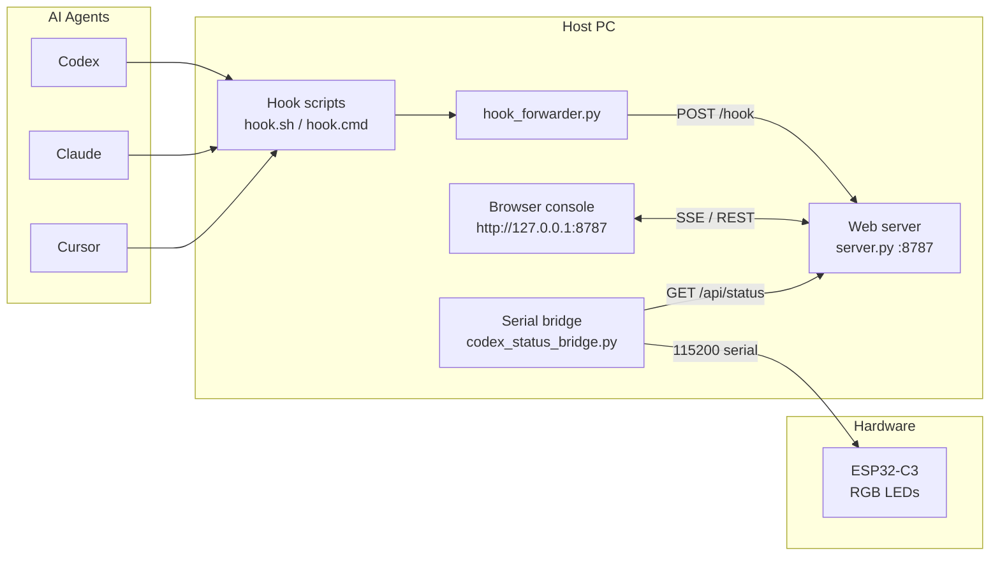

# Agent Light — AI Status Signal Light

**Languages / 语言：** [中文](README.md) · [English](README.en.md)

Maps **Codex / Claude / Cursor** hook events to an ESP32-C3 RGB traffic light in real time — so you can see what the AI is doing (thinking, calling tools, waiting for confirmation, success, or error) without staring at the terminal.

> Simplified fork of [AgentCore-Light v1](https://github.com/FPGAmaster-wyc/AgentCore-Light)

---

## Demo Video

> **Why is there no inline player on GitHub?**  
> GitHub README **strips `<video>` tags** for security and **does not embed** `.MP4` files from the repo like images. Local Markdown previews may play the video, but on GitHub you will see blank space or plain text only.

Click the cover image or links below to open the video on GitHub or in your browser (use Download on the GitHub file page, or right‑click → Save As):

[](https://github.com/coolzoom/agentlight/blob/master/bom_image/agent%20light.MP4)

| How to watch | Link |
|--------------|------|
| GitHub file page (recommended) | [Open `agent light.MP4`](https://github.com/coolzoom/agentlight/blob/master/bom_image/agent%20light.MP4) |
| Direct link (play / download) | [Raw video URL](https://raw.githubusercontent.com/coolzoom/agentlight/master/bom_image/agent%20light.MP4) |

**To show motion directly in README:**

1. Trim a **10–15 s clip** to **GIF** as `bom_image/demo.gif` and embed with `` (GitHub supports GIF).
2. Upload the full video to **YouTube / Bilibili** and link from README.
3. Drag MP4 into a GitHub **Issue / Release** and use the `user-attachments` URL (works in Issue bodies; README still prefers GIF or external links).

---

## Features

| Feature | Description |
|---------|-------------|
| Multi-agent | Listens to Codex, Claude Code, and Cursor hooks at once |
| Web console | Live lamp preview, sessions, manual state simulation |
| Serial / BLE | USB serial by default; BLE service in firmware (optional) |
| Auto device ID | Finds COM port by `agent-signal-light-v1` |
| Configurable effects | Event → effect mapping in Web UI or `config.json` |
| One-click scripts | macOS / Linux `.sh` and Windows `.bat` for install, start, stop |

---

## Architecture



**Data flow:**

1. AI tool fires a hook → `hook_forwarder.py` POSTs JSON to the web server.
2. Web server aggregates sessions and computes `device_status` (idle / thinking / busy / …).
3. Serial bridge polls `/api/status` every 0.5 s and sends one line to the ESP32 (e.g. `busy\n`).
4. Firmware drives PWM effects; browser stays in sync via SSE.

---

## Bill of Materials (BOM)

| # | Part | ~Price | Notes |
|---|------|--------|-------|
| 1 | Mini traffic-light keychain | ≈ ¥5 | Built-in R/Y/G LEDs — lamp body to hack |
| 2 | ESP32-C3 dev board | ≈ ¥8 | USB-CDC native serial recommended |


> Purchase links: [`bom_image/bom.txt`](bom_image/bom.txt)

---

## Wiring

Connect the keychain LEDs to ESP32-C3 GPIO (active **low** by default; change `LED_ACTIVE_HIGH` in firmware if needed):

| Color | GPIO | Firmware constant |
|-------|------|-------------------|
| Red | **GPIO 20** | `RED_LED_PIN` |
| Yellow | **GPIO 2** | `YELLOW_LED_PIN` |
| Green | **GPIO 21** | `GREEN_LED_PIN` |


USB to PC, serial **115200** baud. On boot the device prints:

```
READY ID=agent-signal-light-v1
```

---

## Effects & State Mapping

### Hardware effects (serial command → firmware)

| Command | Effect | Typical scenario |
|---------|--------|------------------|
| `idle` | Green breathing | Session idle / 5 s after task ends |
| `thinking` | R → Y → G chase | User submits prompt |
| `ai` | Slow RGB chase | Subagent / compact |
| `busy` | Yellow slow blink (550 ms) | Tool in use |
| `wait_confirm` | Yellow fast blink (550 ms) | Permission / user input |
| `error` | Red fast blink (130 ms) | Task failed |
| `success` | Green solid 5 s → auto idle | Task completed |
| `off` | All off | Session ended |

### Agent events → device status (web server)

| Hook event | device_status | Serial command |
|------------|---------------|----------------|
| `SessionStart` | idle | `idle` |
| `UserPromptSubmit` | thinking | `thinking` |
| `PreToolUse` / `PostToolUse` | busy | `busy` |
| `PermissionRequest` / `Notification` | wait_confirm | `wait_confirm` |
| `Stop` | success (decays to idle after 5 s) | `success` → `idle` |
| `StopFailure` | error | `error` |
| `SessionEnd` | off | `off` |

> `success` lasts **5 seconds** (`SUCCESS_HOLD_MS = 5000`) in both web server and firmware, then returns to idle. See [`README-修复说明.md`](README-修复说明.md) (Chinese fix notes).

---

## Repository Layout

```
agentlight/
├── README.md                    # Chinese (default)
├── README.en.md                 # English
├── README-修复说明.md            # Fix notes (Chinese)
├── bom_image/                   # Demo media, wiring photos, BOM
├── src-py/                      # ★ Recommended: Python host stack
│   ├── 00-一键安装并启动.sh
│   ├── 00-一键安装并启动.bat
│   ├── requirements.txt
│   ├── codex_status_bridge.py   # Serial bridge (API → ESP32)
│   ├── serial_device.py         # Port detection by device ID
│   ├── agent_light_control.py   # Manual test menu
│   └── agent-signal-light-web/
│       ├── server.py            # HTTP + SSE web server
│       ├── hook_forwarder.py    # Hook forwarder
│       ├── install_hooks.py     # Install Codex/Claude/Cursor hooks
│       ├── static/              # Web console frontend
│       └── config.default.json  # Default effect config
├── src/                         # Legacy (Node.js web + Python bridge)
│   └── … (similar layout; web is server.js)
└── src-esp32/                   # ESP32-C3 firmware (PlatformIO)
    ├── platformio.ini
    └── src/main.ino
```

---

## Quick Start

### Requirements

- **Python 3.9+** (3.12 recommended)
- **macOS / Linux**: optional Homebrew for Python
- **Windows**: Python 3.12+ (`winget` install attempted by script)
- **Firmware flash**: PlatformIO or Arduino IDE
- **Legacy `src/` stack also needs**: Node.js 18+

### 1. Flash firmware (first time)

```bash
# Stop serial bridge so COM port is free
cd src-py && ./00-一键安装并启动.sh --stop

cd src-esp32
python3 -m platformio run -t upload --upload-port /dev/cu.usbmodem2101
# Windows example: --upload-port COM3
```

Or use the prebuilt archive `agentcore-light-v1-firmware-20260611.zip` if provided in the repo.

### 2. Install & start (Python stack, recommended)

**macOS / Linux:**

```bash
cd src-py
./00-一键安装并启动.sh
# Installs deps + hooks + starts web + serial bridge
```

**Windows:**

```bat
cd src-py
00-一键安装并启动.bat
```

Opens **http://127.0.0.1:8787** when ready.

### 3. Common commands

| Command | Action |
|---------|--------|
| `./00-一键安装并启动.sh` | Install + start |
| `./00-一键安装并启动.sh --install-only` | Install only |
| `./00-一键安装并启动.sh --start-only` | Start only |
| `./00-一键安装并启动.sh --stop` | Stop web + bridge |

Pass the same flags to `00-一键安装并启动.bat` on Windows.

### 4. Manual lamp test

```bash
cd src-py && ./00-一键安装并启动.sh --stop
python3 agent_light_control.py
```

---

## Hook Installation

Running `./00-一键安装并启动.sh` (no args or `--install-only`) writes:

| Target | Path |
|--------|------|
| Codex workspace hooks | `src-py/.codex/hooks.json` |
| Codex user hooks | `~/.codex/hooks.json` |
| Claude hooks | `~/.claude/settings.json` |
| Cursor workspace hooks | `src-py/.cursor/hooks.json` |
| Cursor user hooks | `~/.cursor/hooks.json` |

Entry scripts: `agent-signal-light-web/hook.sh` (macOS) or `hook.cmd` (Windows) → `hook_forwarder.py`.

> **Note:** Do not run `src/` and `src-py/` web servers together — both use port **8787**. Run `--stop` on one before starting the other.

---

## Web Console

At http://127.0.0.1:8787 you can:

- Preview lamp state live (SSE)
- Filter sessions by agent (all / claude / codex / cursor)
- Simulate states with G/Y/W/R/O shortcuts
- Edit event → effect bindings (saved to `data/config.json`)

### REST API

| Method | Path | Description |
|--------|------|-------------|
| `GET` | `/api/status` | Aggregated status (polled by serial bridge) |
| `GET` | `/api/config` | Read config |
| `POST` | `/api/config` | Save config |
| `POST` | `/hook` | Agent hook JSON |
| `POST` | `/event` | Manual test (G/Y/W/R/O) |
| `POST` | `/api/agent-filter` | Set agent filter |
| `POST` | `/api/session-select` | Pin controlling session |
| `GET` | `/stream` | SSE live updates |

**Manual test:**

```bash
curl -s -X POST http://127.0.0.1:8787/event -d 'Y'
curl -s http://127.0.0.1:8787/api/status | python3 -m json.tool
```

---

## Environment Variables

| Variable | Default | Description |
|----------|---------|-------------|
| `PORT` | `8787` | Web server port |
| `AGENT_SIGNAL_LIGHT_PORT` | `8787` | Hook forwarder target port |
| `AGENT_LIGHT_DEVICE_ID` | `agent-signal-light-v1` | Expected device ID for port scan |
| `AGENT_LIGHT_LEGACY_DETECT` | empty | Set to `1` to fall back to “first ESP port” |

---

## Log Files

| Component | Path |
|-----------|------|
| Web server | `src-py/.run/web-server.log` |
| Serial bridge | `src-py/.run/serial-bridge.log` |
| Hook forwarder | `src-py/agent-signal-light-web/hook.log` |

---

## FAQ

**Q: `Address already in use` when starting Python stack?**  
A: Old Node server still running. Run `src-py/00-一键安装并启动.sh --stop` or `src/00-一键安装并启动.sh --stop`.

**Q: Lamp does not follow AI activity?**  
A: Check hooks installed, web server up, and bridge connected (log shows `已连接 /dev/cu.xxx` or your COM port).

**Q: Manual test does nothing?**  
A: Stop the bridge with `--stop` first; otherwise it overwrites your commands.

**Q: `success` never returns to idle?**  
A: Update web server + firmware; ensure no higher-priority hook session is active. See [`README-修复说明.md`](README-修复说明.md).

**Q: `src/` vs `src-py/`?**  
A: Prefer **`src-py/`** (pure Python, no Node.js). `src/` is the earlier Node.js web stack; still maintained, same behavior.

---

## Timing Constants (keep in sync when changing)

| Location | Constant | Value |
|----------|----------|-------|
| Firmware `main.ino` | `SUCCESS_HOLD_MS` | 5000 ms |
| Web `server.py` | `SUCCESS_HOLD_MS` | 5000 ms |
| Serial bridge | `COMMAND_RESEND_SECONDS` | 2.0 s |
| Serial bridge | `DEFAULT_INTERVAL` | 0.5 s |

---

## Related Docs

- [`README-修复说明.md`](README-修复说明.md) — success decay, effect alignment, regression tests (Chinese)
- [`bom_image/bom.txt`](bom_image/bom.txt) — hardware purchase links

---

## License

For learning and personal DIY. Please credit the project if you redistribute or commercialize derivatives.
