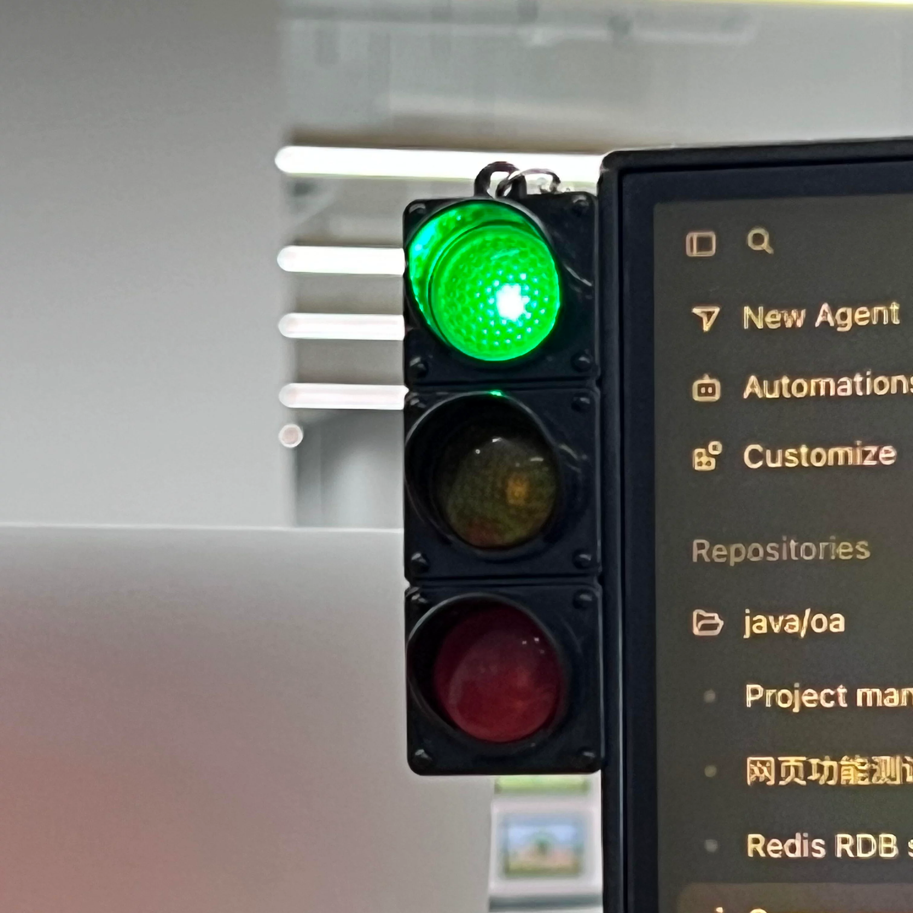
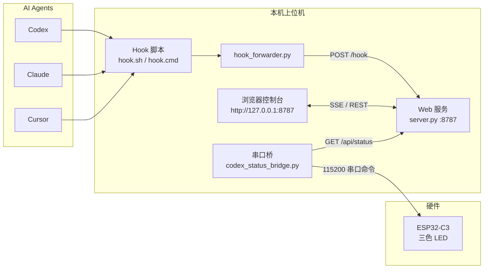
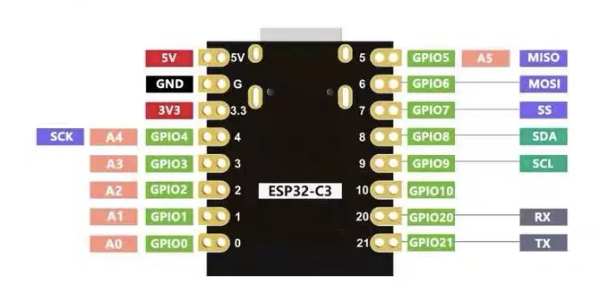
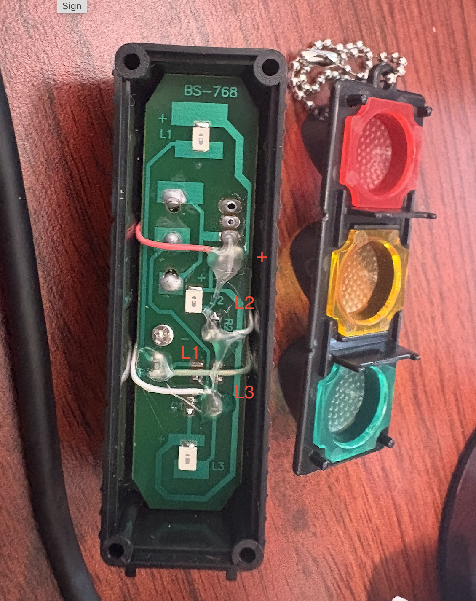
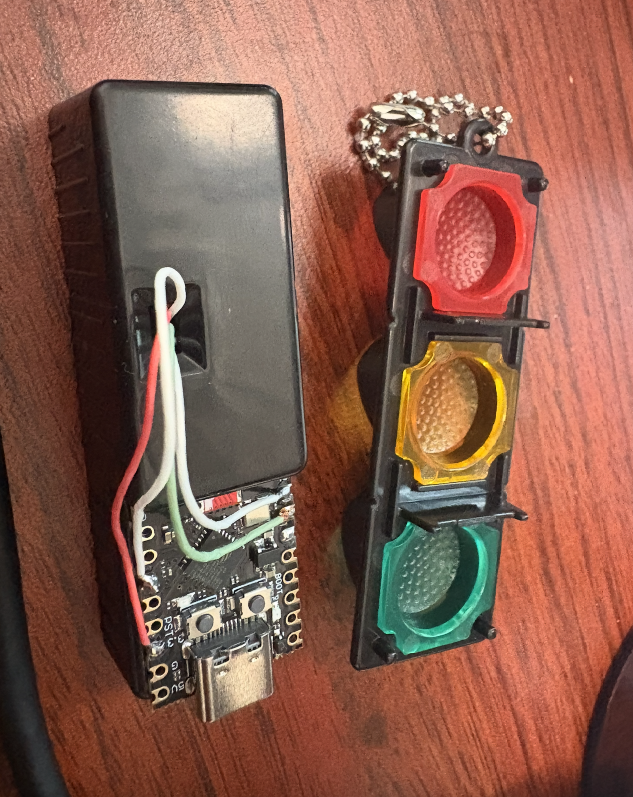

# Agent Light — AI 工作状态信号灯

将 **Codex / Claude / Cursor** 的 Hook 事件实时映射到 ESP32-C3 三色灯，让你不用盯着终端也能感知 AI 当前在做什么：思考、调用工具、等待确认、任务完成或出错。

---
## 成品预览


---

## 演示视频

> **为什么在 GitHub 上看不到播放器？**  
> GitHub 的 README 出于安全策略会**过滤 `<video>` 标签**，也**不支持**像图片那样内嵌播放仓库里的 `.MP4` 文件。本地 Markdown 预览器可以播放，但推到 GitHub 后只会显示空白或纯文字。

点击下方封面图或链接，在 GitHub 文件页 / 浏览器中打开视频（GitHub 文件页右上角有下载按钮，也可右键「另存为」）：

[](https://github.com/coolzoom/agentlight/blob/master/bom_image/agent%20light.MP4)

| 观看方式 | 链接 |
|----------|------|
| GitHub 文件页（推荐） | [打开 `agent light.MP4`](https://github.com/coolzoom/agentlight/blob/master/bom_image/agent%20light.MP4) |
| 直链（浏览器可播放/下载） | [Raw 视频地址](https://raw.githubusercontent.com/coolzoom/agentlight/master/bom_image/agent%20light.MP4) |

**若希望在 README 里直接看到动效**，可选方案：

1. 截取 10–15 秒片段转为 **GIF**，放在 `bom_image/demo.gif`，用 `` 嵌入（GitHub 支持 GIF）。
2. 上传完整视频到 **B 站 / YouTube**，在 README 里放外链。
3. 在 GitHub **Issue / Release** 中拖入 MP4，使用生成的 `user-attachments` 链接（适用于 Issue 正文，README 仍建议用 GIF 或外链）。

---

## 功能概览

| 能力 | 说明 |
|------|------|
| 多 Agent 支持 | 同时监听 Codex、Claude Code、Cursor 的 Hook 事件 |
| Web 控制台 | 浏览器实时预览灯效、查看会话、手动模拟状态 |
| 串口 / BLE | 默认 USB 串口驱动硬件；固件内置 BLE 服务（可选） |
| 设备自动识别 | 按 `agent-signal-light-v1` 设备 ID 自动探测 COM 口 |
| 可配置灯效 | 事件 → 灯效映射可在 Web 控制台或 `config.json` 中编辑 |
| 一键脚本 | macOS / Linux `.sh` 与 Windows `.bat` 安装、启动、停止 |

---

## 系统架构



**数据流简述：**

1. AI 工具触发 Hook → `hook_forwarder.py` 将 JSON 事件 POST 到 Web 服务。
2. Web 服务聚合多会话状态，计算当前 `device_status`（idle / thinking / busy / …）。
3. 串口桥每 0.5s 轮询 `/api/status`，向 ESP32 发送一行命令（如 `busy\n`）。
4. 固件解析命令并驱动 PWM 灯效；浏览器通过 SSE 同步展示。

---

## 硬件清单（BOM）

| 序号 | 物料 | 参考价 | 说明 |
|------|------|--------|------|
| 1 | 车辆红绿灯钥匙挂扣 | ≈ ¥5 | 内置红 / 黄 / 绿三色 LED，改造灯体 |
| 2 | ESP32-C3 开发板 | ≈ ¥8 | 推荐 USB-CDC 原生串口款 |




> 淘宝链接见 [`bom_image/bom.txt`](bom_image/bom.txt)

---

## 接线说明

将钥匙扣上的三色 LED 分别接到 ESP32-C3 GPIO（低电平点亮，可在固件中改 `LED_ACTIVE_HIGH`）：

| 颜色 | GPIO | 固件常量 |
|------|------|----------|
| 红灯 | **GPIO 20** | `RED_LED_PIN` |
| 黄灯 | **GPIO 2** | `YELLOW_LED_PIN` |
| 绿灯 | **GPIO 21** | `GREEN_LED_PIN` |





USB 连接电脑后，串口波特率 **115200**。设备启动时会输出：

```
READY ID=agent-signal-light-v1
```

---

## 灯效与状态映射

### 硬件灯效（串口命令 → 固件）

| 命令 | 灯效 | 典型场景 |
|------|------|----------|
| `idle` | 绿灯呼吸 | 会话空闲 / 任务结束 5 秒后 |
| `thinking` | 红 → 黄 → 绿 追逐 | 用户提交 Prompt |
| `ai` | 慢速 RGB 追逐 | AI 子任务 / Compact |
| `busy` | 黄灯慢闪（550ms） | 工具调用中 |
| `wait_confirm` | 黄灯快闪（550ms） | 等待用户确认 / 权限 |
| `error` | 红灯快闪（130ms） | 任务失败 |
| `success` | 绿灯常亮 5 秒 → 自动 idle | 任务成功完成 |
| `off` | 全灭 | 会话结束 |

### Agent 事件 → 设备状态（Web 服务逻辑）

| Hook 事件 | device_status | 串口命令 |
|-----------|---------------|----------|
| `SessionStart` | idle | `idle` |
| `UserPromptSubmit` | thinking | `thinking` |
| `PreToolUse` / `PostToolUse` | busy | `busy` |
| `PermissionRequest` / `Notification` | wait_confirm | `wait_confirm` |
| `Stop` | success（5s 后衰减为 idle） | `success` → `idle` |
| `StopFailure` | error | `error` |
| `SessionEnd` | off | `off` |

> `success` 在 Web 服务与固件中均停留 **5 秒**（`SUCCESS_HOLD_MS = 5000`），之后自动回到 idle。详见 [`README-修复说明.md`](README-修复说明.md)。

---

## 目录结构

```
agentlight/
├── README.md                    # 本文档
├── README-修复说明.md            # 近期修复与回归测试说明
├── bom_image/                   # 演示视频、接线图、BOM 图片
├── src-py/                      # ★ 推荐：纯 Python 上位机
│   ├── 00-一键安装并启动.sh
│   ├── 00-一键安装并启动.bat
│   ├── requirements.txt
│   ├── codex_status_bridge.py   # 串口桥（API → ESP32）
│   ├── serial_device.py         # 按设备 ID 探测串口
│   ├── agent_light_control.py   # 手动测试菜单
│   └── agent-signal-light-web/
│       ├── server.py            # HTTP + SSE Web 服务
│       ├── hook_forwarder.py    # Hook 转发器
│       ├── install_hooks.py     # 安装 Codex/Claude/Cursor Hooks
│       ├── static/              # Web 控制台前端
│       └── config.default.json  # 默认灯效配置
├── src/                         # 原版（Node.js Web + Python 桥）
│   └── …（结构类似，Web 为 server.js）
└── src-esp32/                   # ESP32-C3 固件（PlatformIO）
    ├── platformio.ini
    └── src/main.ino
```

---

## 快速开始

### 环境要求

- **Python 3.9+**（推荐 3.12）
- **macOS / Linux**：可选 Homebrew 自动安装 Python
- **Windows**：Python 3.12+（脚本会通过 `winget` 尝试安装）
- **烧录固件**：PlatformIO 或 Arduino IDE
- **src 原版额外需要**：Node.js 18+

### 1. 烧录固件（首次）

```bash
# 烧录前停止串口桥，避免占用 COM 口
cd src-py && ./00-一键安装并启动.sh --stop

cd src-esp32
python3 -m platformio run -t upload --upload-port /dev/cu.usbmodem2101
# Windows 示例：--upload-port COM3
```

也可使用预编译包 `agentcore-light-v1-firmware-20260611.zip`（若仓库内提供）。

### 2. 安装并启动（Python 版，推荐）

**macOS / Linux：**

```bash
cd src-py
./00-一键安装并启动.sh
# 等价于：安装依赖 + 配置 Hooks + 启动 Web + 串口桥
```

**Windows：**

```bat
cd src-py
00-一键安装并启动.bat
```

启动后自动打开 **http://127.0.0.1:8787**

### 3. 常用命令

| 命令 | 作用 |
|------|------|
| `./00-一键安装并启动.sh` | 安装 + 启动 |
| `./00-一键安装并启动.sh --install-only` | 仅安装依赖与 Hooks |
| `./00-一键安装并启动.sh --start-only` | 仅启动服务 |
| `./00-一键安装并启动.sh --stop` | 停止 Web 与串口桥 |

Windows 将上述参数传给 `00-一键安装并启动.bat` 即可。

### 4. 手动测试灯效

```bash
# 先停止串口桥，避免与手动测试冲突
cd src-py && ./00-一键安装并启动.sh --stop

python3 agent_light_control.py
```

---

## Hook 安装说明

运行 `./00-一键安装并启动.sh`（无参数或 `--install-only`）会自动：

| 目标 | 写入位置 |
|------|----------|
| Codex 工作区 Hooks | `src-py/.codex/hooks.json` |
| Codex 用户 Hooks | `~/.codex/hooks.json` |
| Claude Hooks | `~/.claude/settings.json` |
| Cursor 工作区 Hooks | `src-py/.cursor/hooks.json` |
| Cursor 用户 Hooks | `~/.cursor/hooks.json` |

Hook 入口脚本为 `agent-signal-light-web/hook.sh`（macOS）或 `hook.cmd`（Windows），最终调用 `hook_forwarder.py` 转发事件。

> **注意**：若同时使用 `src/` 与 `src-py/`，请先 `./00-一键安装并启动.sh --stop` 停掉旧服务，再启动目标版本，避免 **8787 端口冲突**。

---

## Web 控制台

访问 http://127.0.0.1:8787 可：

- 实时预览三色灯状态（SSE 推送）
- 按 Agent 筛选会话（all / claude / codex / cursor）
- 手动模拟 G/Y/W/R/O 快捷键状态
- 编辑事件 → 灯效绑定并持久化到 `data/config.json`

### REST API

| 方法 | 路径 | 说明 |
|------|------|------|
| `GET` | `/api/status` | 当前聚合状态（供串口桥轮询） |
| `GET` | `/api/config` | 读取配置 |
| `POST` | `/api/config` | 保存配置 |
| `POST` | `/hook` | 接收 Agent Hook JSON |
| `POST` | `/event` | 手动测试（G/Y/W/R/O） |
| `POST` | `/api/agent-filter` | 设置 Agent 筛选 |
| `POST` | `/api/session-select` | 锁定控制某一会话 |
| `GET` | `/stream` | SSE 实时推送 |

**手动测试示例：**

```bash
curl -s -X POST http://127.0.0.1:8787/event -d 'Y'
curl -s http://127.0.0.1:8787/api/status | python3 -m json.tool
```

---

## 环境变量

| 变量 | 默认值 | 说明 |
|------|--------|------|
| `PORT` | `8787` | Web 服务端口 |
| `AGENT_SIGNAL_LIGHT_PORT` | `8787` | Hook 转发器目标端口 |
| `AGENT_LIGHT_DEVICE_ID` | `agent-signal-light-v1` | 串口探测目标设备 ID |
| `AGENT_LIGHT_LEGACY_DETECT` | 空 | 设为 `1` 时回退到旧版「第一个 ESP 口」探测 |

---

## 日志位置

| 组件 | 日志路径 |
|------|----------|
| Web 服务 | `src-py/.run/web-server.log` |
| 串口桥 | `src-py/.run/serial-bridge.log` |
| Hook 转发 | `src-py/agent-signal-light-web/hook.log` |

---

## 常见问题

**Q：启动 Python 版报 `Address already in use`？**  
A：旧版 Node 服务仍在运行。执行 `src-py/00-一键安装并启动.sh --stop` 或 `src/00-一键安装并启动.sh --stop`。

**Q：灯不跟随 AI 状态变化？**  
A：确认 Hook 已安装、Web 服务在运行，且串口桥已连接（日志中有 `已连接 /dev/cu.xxx`）。

**Q：手动测试时灯无反应？**  
A：先 `--stop` 停止串口桥，再用 `agent_light_control.py` 测试，避免桥接覆盖手动命令。

**Q：`success` 一直不回到 idle？**  
A：确认 Web 服务与固件均为最新版本，且没有其他高优先级 Hook 会话占用状态。详见 [`README-修复说明.md`](README-修复说明.md)。

**Q：两份上位机选哪个？**  
A：推荐使用 **`src-py/`**（纯 Python，无需 Node.js）。`src/` 为早期 Node.js 版，功能等价，仍在维护。

---

## 时间线常量（修改时需同步）

| 位置 | 常量 | 值 |
|------|------|-----|
| 固件 `main.ino` | `SUCCESS_HOLD_MS` | 5000 ms |
| Web `server.py` | `SUCCESS_HOLD_MS` | 5000 ms |
| 串口桥 | `COMMAND_RESEND_SECONDS` | 2.0 s |
| 串口桥 | `DEFAULT_INTERVAL` | 0.5 s |

---

## 相关文档

- [`README-修复说明.md`](README-修复说明.md) — success 衰减、灯效对齐、回归测试步骤
- [`bom_image/bom.txt`](bom_image/bom.txt) — 硬件采购链接

---

## License

本项目供学习与个人 DIY 使用。商用或二次分发请注明来源。
复刻自 https://github.com/FPGAmaster-wyc/AgentCore-Light v1 简化版
